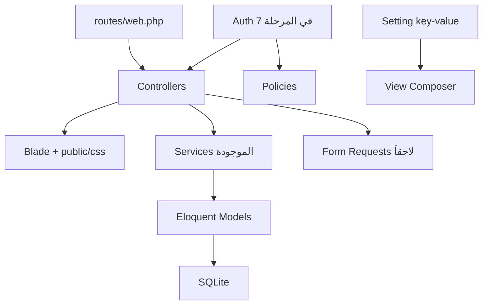

# خطة التطوير المرحلية — تاج الوقار

نُسخ هذا الملف من الخطة الرسمية بتاريخ 17 سبتمبر 2026 ليبقى داخل المشروع بعد إغلاق المحادثة.

المصدر الأصلي (لم يُعدَّل): `C:\Users\LENOVO\.cursor\plans\خطة_تطوير_تاج_الوقار_22264a14.plan.md`

رابط الدخول المحلي عند الحفظ: [http://127.0.0.1:8000/login](http://127.0.0.1:8000/login)

---

هذه خطة تنفيذ وليست تنفيذًا. الأساس هو المشروع الحالي. لا إعادة بناء، ولا تغيير Laravel أو Blade أو SQLite أو نظام CSS في `public/css` إلا لسبب ضروري يظهر داخل المرحلة نفسها.

## البنية المعمارية الموصى بها (تطور تدريجي)

الإبقاء على MVC الحالي، مع تقويته بدل استبداله:

**يُبنى عليه الآن**

- Controllers كمدخل HTTP كما هي في `app/Http/Controllers`
- Services للمجال: `AiAssistant`، `NoorProgressService`، `DataBackupService`
- Models + `App\Support\Quran` + إعدادات key-value في `Setting`
- Blade layouts الحالية + CSS اليدوي

**يُضاف فقط عند الحاجة**

- Form Requests عندما تُلمس نماذج كبيرة (طلاب، حصة، إعدادات)
- Policies بعد الحسابات (المرحلة 7)
- عمود `account_id` / نطاق المستأجر في المرحلة 9 فقط، لا الآن

**لا يُقترح إدخاله**

- Vue / React / Livewire / Inertia
- Tailwind كبديل لـ `public/css/app.css`
- Repository pattern أو DDD مجلدات جديدة
- MySQL أو API منفصل قبل الحاجة
- حذف مفاتيح الإعدادات الجاهزة للأهل/الاشتراك؛ تبقى كعقود مستقبلية

---

## ما يجب إصلاحه قبل أي ميزة جديدة

1. تغطية اختبارية لمسار المعلمة اليومي: طالب → موعد → بدء حصة → إنهاء → تحديث الملف → ملخص.
2. Factories للنماذج المستخدمة فعليًا (`Student`, `Appointment`, `Lesson`) بدل إنشاء السجلات يدويًا في كل اختبار.
3. الإبقاء على الاختبارات الحالية ناجحة: `LandingPageTest`، `SettingsTest`، `AppointmentSettingsTest`.
4. عدم بدء Auth أو SaaS أو إشعارات قبل أن يكون مسار الحصة محميًا باختبارات؛ أي انكسار هناك يوقف يوم المعلمة.

## ما لا ينبغي لمسه الآن

- `_legacy_static` والنسخة القديمة
- `resources/views/welcome.blade.php` وVite/Tailwind غير المستخدمين (تنظيف تجميلي لاحقًا فقط)
- هوية الهبوط الخضراء في `public/css/landing.css` ونسخة التسويق إلا في مهمة هبوط صريحة
- رموز التصميم في `public/css/app.css` (`--primary`, `--bg`, نصف القطر) إلا لتوسيع أنماط موجودة
- جدول `users` ونموذج `User` قبل المرحلة 7
- مفاتيح `Setting::DEFAULTS` الخاصة بالأهل/الإشعارات/الاشتراك (لا حذف)
- Laravel وSQLite ومسار `start.bat` إلا إذا اتفقتم على تغيير تشغيل محدد

## الملفات الحساسة (تعامل بحذر)

- `routes/web.php` — كل التنقل يعتمد عليها
- `app/Http/Controllers/LessonController.php` و`Student::applyLesson` — قلب الحصة
- `app/Services/NoorProgressService.php` — الدرجات والواجبات والاقتراح
- `app/Services/AiAssistant.php` — مفتاح OpenAI وبيانات الطالب
- `app/Models/Setting.php` و`SettingController`
- `app/Providers/AppServiceProvider.php` — الشريط الجانبي والمظهر
- `resources/views/layouts/app.blade.php`
- `public/css/app.css`
- `start.bat` و`DatabaseSeeder`
- `app/Services/DataBackupService.php` — بيانات حقيقية

## اختبارات يجب إضافتها قبل التطوير الواسع

تُكتب كـ Feature tests بـ PHPUnit + `RefreshDatabase`، عبر `php artisan make:test --phpunit`، مع قراءة مهارة الاختبارات عند التنفيذ.

- `Student` factory + إنشاء/تعديل/حذف/بحث
- دورة الحصة: `start` → `finish` يحدّث الطالب ويضع الموعد `done`؛ `abort` يعيده `upcoming`
- تعارض المواعيد يبقى كما هو (اختبار موجود)
- نور البيان: تفعيل التتبع ينشئ profiles؛ إنهاء حصة مع تقييم يحدّث النسبة
- المساعد: شرح محلي بدون مفتاح؛ لا ينكسر إن فشل الطلب الخارجي
- الصفحات تُحمَّل: ملاحظات، تقارير، نور، كتاب
- الإعدادات: الحساب والتقويم والمظهر (جزء موجود)

لا تُضاف اختبارات لكل تبويب إعدادات دفعة واحدة.

---

## المرحلة 1 — تحسين واستقرار النظام الحالي

**الهدف:** جعل المسار الحالي آمنًا للتطوير: اختبارات، مصانع، ومنع انكسار صامت. بدون ميزات ظاهرة للمعلمة.

**الصفحات المتأثرة:** لا تغيير بصري مقصود. التحقق فقط أن `/dashboard`, `/students`, `/lessons`, `/appointments`, `/settings`, `/` تبقى كما هي.

**الملفات المحتمل تعديلها (عند التنفيذ لاحقًا):** `database/factories/*`, `tests/Feature/*`, ربما `tests/Unit/ExampleTest.php` إن بقي قالبًا. لا مساس بـ CSS أو الهبوط.

**قاعدة البيانات:** لا migrations.

**المخاطر:** الإفراط في إعادة هيكلة Controllers بحجة النظافة؛ هذا خارج نطاق المرحلة.

**بدون تأثير على الوظائف؟** نعم، إذا اقتصر العمل على اختبارات ومصانع.

## المرحلة 2 — تحسين تجربة المستخدم UX/UI

**الهدف:** تسهيل الاستخدام اليومي على نفس الهوية البصرية (بنفسجي التطبيق / أخضر الهبوط)، دون إعادة تصميم.

**مرشحون للقيمة:** حالات فارغة أوضح، توحيد صفحتي الكتاب/المساعد إن بقي التكرار مربكًا، إكمال الثيم الداكن الجزئي في `public/css/app.css`، وضوح أزرار بدء الحصة من لوحة اليوم، عدم ترجمة الواجهة في هذه المرحلة.

**الصفحات:** `layouts.app`، لوحة اليوم، الطلاب، المواعيد، الحصة، الإعدادات (تنقل التبويبات)، ربما الهبوط فقط لإصلاح تضليل «تسجيل الدخول» نصًا لا منطق Auth.

**الملفات:** Blade في `resources/views/**`، إضافات محدودة على كلاسات موجودة في `public/css/app.css`. تجنب `landing.css` إلا لتصحيح صغير.

**قاعدة البيانات:** لا.

**المخاطر:** تغيير ألوان/خطوط يكسر إحساس المنتج؛ لمس الهبوط يختلط مع التسويق.

**بدون تأثير؟** نعم إن بقيت التدفقات نفسها وتغيّر العرض فقط.

## المرحلة 3 — تطوير إدارة الطلاب والحصص

**الهدف:** تقوية عمل المعلمة اليومي: ملف أغنى، حضور/غياب إن لزم، ملاحظات أوضح، سجل حصة أدق. هذا أعلى قيمة تشغيلية بعد الاستقرار.

**الصفحات:** الطلاب، نموذج الطالب، المواعيد، جلسة الحصة، الملخص، الملاحظات.

**الملفات:** `StudentController`, `LessonController`, `AppointmentController`, `NoteController`, نماذج `Student`/`Lesson`/`Appointment`, views المرتبطة، ربما Form Request واحد للنماذج الكبيرة.

**قاعدة البيانات (إن اتُّفق لاحقًا):** جدول ملاحظات مستقل أو حقل غياب على الموعد؛ لا يُضاف إلا بحاجة واضحة. مواضع الحفظ تبقى JSON كما هي.

**المخاطر:** كسر `applyLesson` أو حالات الموعد (`upcoming`/`progress`/`done`/`cancelled`).

**بدون تأثير؟** جزئيًا: الإضافات يجب أن تكون اختيارية بجانب الحقول الحالية.

## المرحلة 4 — تطوير نور البيان

**الهدف:** جعل التتبع usable خارج «جزء من الحصة»: تقدم الدرس، أنشطة، واجبات، اقتراح التالي.

**الصفحات:** `/noor`, `/students/{id}/skills`, جزء نور في `lessons/session` و`lessons/summary`.

**الملفات:** `NoorController`, `NoorProgressService`, `NoorSeeder`, views `noor/*` و`students/skills`, `config/noor.php`.

**قاعدة البيانات:** الجداول موجودة. قد تُضاف أعمدة صغيرة لاحقًا (تاريخ إتقان، ترتيب واجب) لا جداول جديدة كبيرة إلا لسبب.

**المخاطر:** إعادة حساب الدرجات (`quran_score`, `noor_score`, …) قد تُظهر أرقامًا مختلفة للطلاب الحاليين.

**بدون تأثير؟** نعم إذا بقي التسجيل من داخل الحصة يعمل كما هو، والإضافات اختيارية.

## المرحلة 5 — تطوير التقارير

**الهدف:** استبدال بطاقات الحفظ/المراجعة النصية في `reports/index.blade.php` بملخص حقيقي قابل للطباعة، وتقرير لكل طالب إن أمكن.

**الصفحات:** `/reports`، تبويب التقارير في الإعدادات (المفاتيح موجودة أصلًا).

**الملفات:** `ReportController`, `reports/index.blade.php`, ربما خدمة `ReportService` جديدة بجانب الخدمات الحالية.

**قاعدة البيانات:** غالبًا لا؛ البيانات من `lessons` و`students` و`appointments`.

**المخاطر:** تقارير بطيئة إن جُلبت كل الحصص دون تجميع؛ الطباعة تكسر التخطيط.

**بدون تأثير؟** نعم: توسيع صفحة موجودة وإخفاء البطاقات الناقصة.

## المرحلة 6 — الذكاء الاصطناعي

**الهدف:** تشغيل ما هو مفيد فعلًا (شرح، ملخص) بثبات، ثم ربط مفاتيح محفوظة وغير منفَّذة بحذر، مع الإبقاء على الوضع المحلي بدون مفتاح.

**الصفحات:** المساعد، الكتاب، ملخص الحصة، تبويب الذكاء في الإعدادات.

**الملفات:** `AiAssistant`, `AssistantController`, `LessonController@finish`, `settings/sections/ai.blade.php`.

**قاعدة البيانات:** لا. المفتاح يبقى في settings/env.

**المخاطر:** تسريب ملاحظات الطالب إلى OpenAI؛ تعطيل الحصة إن فشل الـ API (اليوم هناك fallback — يجب ألا يُزال).

**بدون تأثير؟** نعم إذا بقي المسار المحلي هو الافتراض عند غياب المفتاح أو الفشل.

## المرحلة 7 — الحسابات والصلاحيات

**الهدف:** حساب معلمة واحد أولًا (جلسة حقيقية)، وربط زر الهبوط بمنطق دخول، دون تعدد مستأجرين.

**الصفحات:** هبوط (تسجيل الدخول يصبح حقيقيًا)، صفحات جديدة login، وكل صفحات التطبيق تُغلق بـ middleware.

**الملفات:** `routes/web.php`, `bootstrap/app.php`, `User`, إعدادات المعلمة، `layouts.marketing`. حزمة Breeze اختيارية بشرط عدم فرض Tailwind على التطبيق.

**قاعدة البيانات:** استخدام `users` الموجود؛ ربما `user_id` اختياري على settings لاحقًا. لا multi-tenant هنا.

**المخاطر:** قفل المعلمة الحالية خارج النظام بعد الترقية؛ `start.bat` + بيانات تجريبية تحتاج مستخدمًا افتراضيًا موثّقًا.

**بدون تأثير؟** لا — هذه أول مرحلة تكسر «الكل مفتوح». تحتاج مسار ترقية وseed لمستخدم محلي.

## المرحلة 8 — الإشعارات وأولياء الأمور

**الهدف:** تفعيل تفضيلات محفوظة اليوم: تذكير داخل النظام أولًا، ثم قناة أهل واحدة بسيطة بعد وجود الحسابات.

**الصفحات:** تبويبا الإشعارات/الأهل في الإعدادات؛ لاحقًا صفحات أهل منفصلة.

**الملفات:** `Setting` keys الحالية، ربما Job/أمر مجدول لتذكير الحصة، قوالب بريد لاحقًا.

**قاعدة البيانات:** جدول `parent_contacts` أو حقول ولي على الطالب؛ جلسات أهل بعد المرحلة 7.

**المخاطر:** بناء بوابة أهل قبل Auth يضاعف العمل. البريد غير مضبوط (`MAIL_MAILER=log`).

**بدون تأثير؟** الإشعارات داخل التطبيق نعم؛ بوابة الأهل لا — منتج جديد.

## المرحلة 9 — الاستعداد لـ SaaS

**الهدف:** عزل بيانات كل معلمة، لا نظام دفع وهمي. واجهة الاشتراك في الإعدادات تبقى placeholder حتى يوجد دفع حقيقي.

**الصفحات:** لا منتج جديد للمعلمة المحلية أولًا؛ داخليًا نطاق الاستعلامات.

**الملفات:** كل الـ queries على `Student`/`Appointment`/`Lesson`/`Setting`، النسخ الاحتياطي، الهبوط.

**قاعدة البيانات:** `accounts` + `account_id` على الجداول الأساسية؛ settings لكل حساب. migration كبيرة وحساسة.

**المخاطر:** نسيان scope يسرب طلاب معلمة لأخرى. لذا لا تُبدأ قبل Auth واختبارات العزل.

**بدون تأثير؟** لا. تُخطط فقط بعد استقرار المراحل 1 و7.

---

## أول Milestone يُنصح بتنفيذه الآن

**الاسم:** Milestone 1 — شبكة أمان المسار اليومي

**النطاق فقط**

- Factories: `Student`, `Appointment`, `Lesson` (وحالات بسيطة إن لزم)
- Feature tests لدورة الطالب والحصة وتحميل الصفحات الأساسية
- الإبقاء على الاختبارات الحالية خضراء
- تشغيل `vendor/bin/pint --dirty --format agent` على ملفات PHP الجديدة فقط

**خارج النطاق:** أي CSS، أي صفحة جديدة، Auth، نور إضافي، تقارير، ذكاء، تعديل `start.bat`، حذف `_legacy_static`

**لماذا هذا أولاً**

- المرحلة 1 هي الأساس الذي طلبتموه، وأعلى تقليل مخاطر قبل المرحلة 3 (أعلى قيمة للمعلمة)
- لا يغيّر ما تراه المعلمة اليوم
- كل مرحلة لاحقة تلمس `LessonController` أو `Student`؛ بدون هذه الاختبارات يصبح التطوير تخمينًا
- يمكن إنهاؤه في جلسة واحدة واضحة

**هل يؤثر على الوظائف الحالية؟** لا، إذا التزم النطاق أعلاه.

---

## الخطوة التالية المقترحة

الموافقة على **Milestone 1 — شبكة أمان المسار اليومي** فقط، ثم إرسال الـ Prompt التالي في محادثة تنفيذ (Agent mode) دون توسيع النطاق.

---

## ملحق: حالة التنفيذ عند حفظ هذا الملف (17 سبتمبر 2026)

هذا الملحق ليس من نص الخطة الأصلية. أُضيف ليوضح أين وصل المشروع عند الإغلاق:

| المرحلة | الحالة |
|---|---|
| 1 استقرار / اختبارات | مكتملة |
| 2 UX/UI | مكتملة |
| 3 إدارة الطلاب والحصص | مكتملة |
| 4 نور البيان | نُفّذت ثم حُذفت لاحقًا بالكامل كمسار وميزة |
| 5 التقارير | مكتملة |
| 6 الذكاء الاصطناعي | مكتملة |
| 7 الحسابات والصلاحيات | مكتملة |
| 8 الإشعارات وأولياء الأمور | مكتملة في نطاقها المنفَّذ |
| 9 الاستعداد لـ SaaS | مكتملة في نطاق العزل (accounts + account_id) |

بعد حذف نور البيان:

- حساب الدرجات انتقل إلى `app/Services/StudentScoreService.php`
- `quran_score` و`tajweed_score` بقيتا، و`overall_score` متوسطهما
- `arabic_score` ومسار نور حُذفا من الواجهة والقاعدة
- نسخة SQLite قبل الحذف: `storage/app/backups/database-before-drop-noor-20260917-145425.sqlite`
